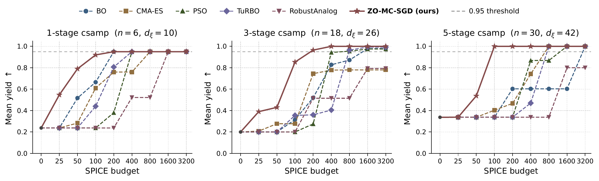
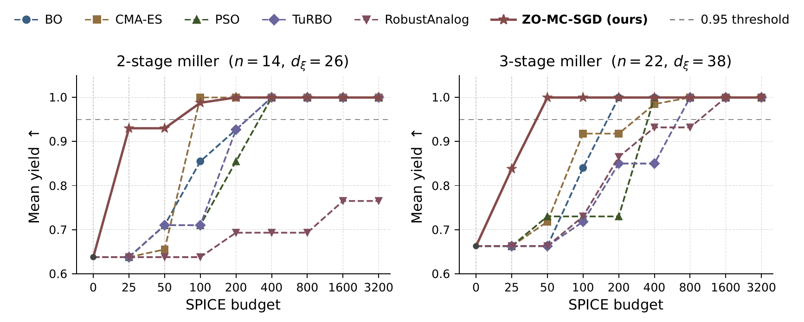

# ZO-MC-SGD

Anonymized code accompanying the submission

> **Sample-Efficient Yield Optimization of Analog Circuits via Stochastic
> Zeroth-Order Methods**

Analog circuits must be sized for **yield** — the fraction of fabricated dies
meeting every specification under process variation. Yield is
non-differentiable and each evaluation costs a Monte Carlo batch of SPICE runs,
so it is expensive to optimize directly. **ZO-MC-SGD** keeps the black-box
setting but recovers a descent direction: it optimizes a smooth surrogate of
specification satisfaction using a Monte Carlo zeroth-order gradient estimated
from process samples, never differentiating the simulator. On five SPICE
benchmarks it reaches mean yield 0.95 within 50–200 simulations, up to 8× fewer
than Bayesian optimization, CMA-ES, particle swarm, TuRBO and RobustAnalog.

This repository contains the optimizer, the five ngspice benchmark circuits,
the five baselines it is compared against, and the scripts that reproduce the
experiments in the paper.

## Results

Mean yield versus SPICE budget, five seeds per point.





## Install

```bash
conda create -n zo-mc-sgd python=3.11 -y
conda activate zo-mc-sgd
conda install -c conda-forge ngspice-lib -y      # libngspice, required for SPICE
pip install -r requirements.txt
pip install -e .
python scripts/check_env.py                       # verify ngspice is reachable
```

Results were produced with Python 3.11.5, numpy 1.24.3, scipy 1.11.1,
scikit-optimize 0.10.2, cma 4.4.4 and torch 2.11.0 (see `requirements.txt`).

## Reproduce

Every method starts from the same `x_init`, is charged the same SPICE budget,
and its returned design is scored under one common protocol: yield over
`n_mc=80` fresh process samples on a fixed ξ-set (seed 555). Each
(circuit, method, budget) cell is run with **five seeds**.

`configs/<circuit>.json` holds the calibrated inputs every method shares —
σ-scale, softplus sharpness α, and the starting design `x_init` — committed so a
clone reproduces the reported numbers. The calibration scripts below regenerate
them from scratch.

```bash
# main budget sweep, B in {25, 50, 100, 200, 400}
python scripts/baseline_comparison.py cs_amp_3stage              # ZO-MC-SGD, BO, CMA-ES, PSO
python scripts/run_natural_objective_baseline.py cs_amp_3stage   # BO/CMA-ES/PSO on the yield-MC objective
python scripts/run_turbo_baseline.py cs_amp_3stage
python scripts/run_robustanalog_baseline.py cs_amp_3stage

# high-budget comparison, B in {800, 1600, 3200}
python scripts/run_highbudget_comparison.py cs_amp_3stage

# self-contained validations (no SPICE)
python scripts/b8_e1_bias_audit.py     # estimator unbiasedness on the synthetic problems
python scripts/b_wallclock.py          # optimizer-internal vs SPICE wall-clock

# regenerate the calibration inputs in configs/
python scripts/sigma_scale_calibration.py cs_amp_3stage
python scripts/loss_yield_calibration.py cs_amp_3stage
python scripts/calibrate_x_init_hard.py
```

Runs write to `experiments/results/<circuit>/` (git-ignored).

## Tests

```bash
pytest tests/ -q      # SPICE-backed tests require libngspice
```

## License

MIT — see [LICENSE](LICENSE).
